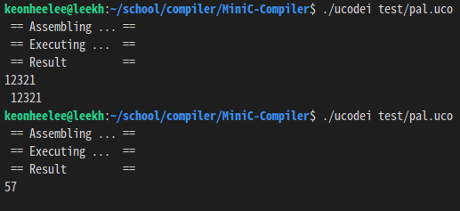
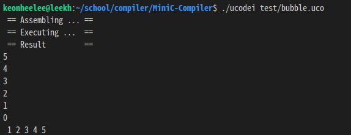
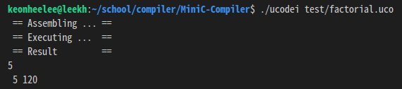
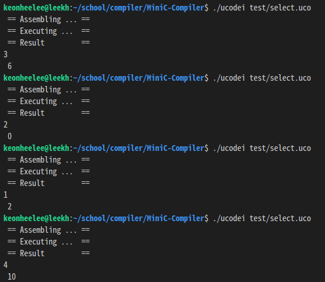

# MiniC-Compiler

 MiniC Compiler use flex & bison/yacc and C.

## The component of Compiler 

1. [Ucode interpreter](./src/ucode)
2. [Lexical Analyzer](./src/lex)
   - reference: [a simple game based on finite automata](https://github.com/KeonHeeLee/simple-pocket-mon-game)
3. [Parser](./src/parser)
4. [Intermediate Language Generator](./src/icg)


## Dependency

- flex
- bison/yacc

## Developing Environment

- OS : Ubuntu 16.04 LTS
- Language : C & C++
- Compiler : gcc & g++

## How to use

**0. Installation**

```bash
$ git clone https://github.com/KeonHeeLee/MiniC-Compiler
$ cd MiniC-Compiler
$ sudo chmod +0777 setup.sh
$ ./setup.sh
```

**1. Generate Intermediate Language**

```bash
$ ./minic <Mini-C file(.mc)>
```

**2. Compile '.uco'(ICG) file**

```bash
$ ./ucodei <ICG file(.uco)>
```

## Demo Snapshots

1. **[Palindrome](./test/pal.mc) (pal.mc)**


2. **[Bubble Sort](./test/bubble.mc) (bubble.mc)**


3. **[Factorial](./test/factorial.mc) (factorial.mc)**


4. **[Select number](./test/select.mc) (select.mc)**


5. **[Selection Sort](./test/selection_sort.mc) (selection_sort.mc)**

